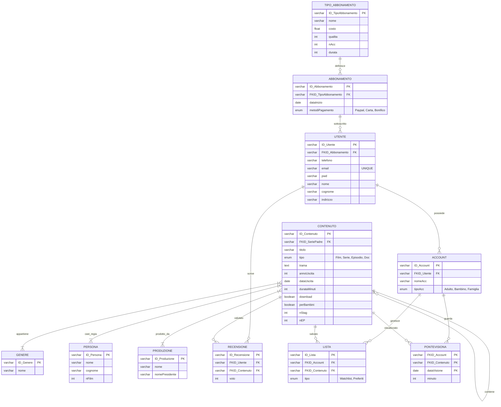

# Progetto Informatica – Fase 1

## Piattaforma di Streaming Video

## 1. Introduzione al progetto

Il progetto prevede la realizzazione di una piattaforma di streaming video (es. *Netflix, Prime Video, MUBI*). Tale piattaforma prende il nome di **Eccessolandia** e ha l'intento di traghettare il pubblico verso il *cinema degli eccessi*, dai più grandi ai più piccoli.

Eccessolandia gestisce la classificazione dei contenuti in **film**, **serie TV** e **documentari** con i rispettivi generi; per le serie TV è noto il numero di stagione ed episodio. Di ogni contenuto sono noti il **regista**, gli **attori** e la **produzione**.

L'utente sulla piattaforma può creare un account (per adulti o per bambini) sul quale gestisce un **abbonamento** che, in base al tipo (*base, standard, premium*), offre diversi livelli di qualità streaming. È possibile creare liste come la *Watchlist* o i *Preferiti*. La piattaforma tiene traccia delle visualizzazioni effettuate e del tempo rimanente alla conclusione di un contenuto. Al termine della visione, l'utente può recensire un contenuto assegnando un voto. Alcuni contenuti possono inoltre essere scaricati per la visione offline.

## 2. Analisi dei requisiti

Quanto segue è la prima fase di un progetto che prevede la realizzazione di un'applicazione web completa e chiara. In questa prima fase il progetto si concentra sul compimento del **diagramma E-R**, dello **schema logico** e del **codice SQL** (DDL, DML). Il diagramma E-R viene realizzato in una prima fase su un foglio di carta e poi trascritto e riprodotto su _*Mermaid*_. In seguito alla realizzazione del diagramma E-R e del rispettivo schema logico, il codice SQL viene progettato e realizzato su un file di _*notepad*_.   

## 3. Diagramma E-R
Diagramma con mermaid



## 4. Schema Logico Relazionale

 PK = Chiave Primaria, FK* = Chiave Esterna.

### Gestione contenuti

* **CONTENUTO** (<u>ID_Contenuto</u>, Titolo, Tipo, FKID_SeriePadre*, Trama, AnnoUscita, DataUscita, DurataMinuti, Download, PerBambini, nStag, nEP)
* **GENERE** (<u>ID_Genere</u>, Nome)
* **PONTECONTENUTOGENERE** (<u>FKID_Contenuto*, FKID_Genere*</u>)

### Produzione e cast

* **PERSONA** (<u>ID_Persona</u>, Nome, Cognome, nFilm)
* **PRODUZIONE** (<u>ID_Produzione</u>, Nome, NomePresidente)
* **PONTECONTENUTORECITATOPERSONA** (<u>FKID_Persona*, FKID_Contenuto*</u>, Ruolo)
* **PONTECONTENUTOPRODUZIONE** (<u>FKID_Produzione*, FKID_Contenuto*</u>)

### Utenti e abbonamenti

* **TIPO_ABBONAMENTO** (<u>ID_TipoAbbonamento</u>, Nome, Costo, Qualita, nAcc, Durata)
* **ABBONAMENTO** (<u>ID_Abbonamento</u>, FKID_TipoAbbonamento*, DataInizio, MetodiPagamento)
* **UTENTE** (<u>ID_Utente</u>, FKID_Abbonamento*, Telefono, Email, Pwd, Nome, Cognome, Indirizzo)

### Account e interazioni con recensioni e cronologia visione

* **ACCOUNT** (<u>ID_Account</u>, FKID_Utente*, NomeAcc, TipoAcc)
* **LISTA** (<u>ID_Lista</u>, FKID_Account*, FKID_Contenuto*, Tipo)
* **PONTEVISIONA** (<u>FKID_Account*, FKID_Contenuto*, DataVisione</u>, Minuto)
* **RECENSIONE** (<u>ID_Recensione</u>, FKID_Utente*, FKID_Contenuto*, Voto)

## 5. Dizionario dei Dati

Di seguito sono descritte tutte le tabelle del database


### Tabella: `CONTENUTO`
Rappresenta l'entità principale per film, serie, episodi e documentari.

| Campo | Tipo | Vincoli | Descrizione |
|------|------|--------|-------------|
| ID_Contenuto | Varchar(10) | PK | Identificativo univoco del contenuto |
| Titolo | Varchar(50) | NOT NULL | Titolo del contenuto |
| Tipo | Enum | NOT NULL | 'Film', 'Serie', 'Episodio', 'Documentario' |
| FKID_SeriePadre | Varchar(10) | FK, NULL | Se Episodio, punta alla Serie madre |
| Trama | Text | - | Descrizione della trama |
| AnnoUscita | Int | NOT NULL | Anno di uscita |
| DataUscita | Date | - | Data precisa di pubblicazione |
| DurataMinuti | Int | Def. 0 | Durata in minuti |
| Download | Bool | Def. False | Se scaricabile offline |
| PerBambini | Bool | Def. False | Se adatto ai bambini |
| nStag | Int | NULL | Numero stagione (solo episodi) |
| nEP | Int | NULL | Numero episodio (solo episodi) |

### Tabella: `GENERE`
Elenco dei generi cinematografici.

| Campo | Tipo | Vincoli | Descrizione |
|------|------|--------|-------------|
| ID_Genere | Varchar(10) | PK | Identificativo del genere |
| Nome | Varchar(15) | NOT NULL | Nome del genere  |

### Tabella: `PONTECONTENUTOGENERE`
Associa contenuti ai generi (relazione N:M).

| Campo | Tipo | Vincoli | Descrizione |
|------|------|--------|-------------|
| FKID_Contenuto | Varchar(10) | PK, FK | Riferimento al contenuto |
| FKID_Genere | Varchar(10) | PK, FK | Riferimento al genere |


### Tabella: `PERSONA`
Archivio di attori e registi.

| Campo | Tipo | Vincoli | Descrizione |
|------|------|--------|-------------|
| ID_Persona | Varchar(10) | PK | Identificativo della persona |
| Nome | Varchar(15) | NOT NULL | Nome proprio |
| Cognome | Varchar(20) | NOT NULL | Cognome |
| nFilm | Int | NOT NULL | Numero di film accreditati |

### Tabella: `PRODUZIONE`
Case di produzione.

| Campo | Tipo | Vincoli | Descrizione |
|------|------|--------|-------------|
| ID_Produzione | Varchar(10) | PK | Identificativo della casa produttrice |
| Nome | Varchar(15) | NOT NULL | Nome della casa  |
| NomePresidente | Varchar(10) | NOT NULL | Nome del presidente |

### Tabella: `PONTECONTENUTORECITATOPERSONA`
Collega le persone ai contenuti specificando il ruolo.

| Campo | Tipo | Vincoli | Descrizione |
|------|------|--------|-------------|
| FKID_Persona | Varchar(10) | PK, FK | Riferimento alla persona |
| FKID_Contenuto | Varchar(10) | PK, FK | Riferimento al contenuto |
| Ruolo | Varchar(10) | NOT NULL | Ruolo svolto|

### Tabella: `PONTECONTENUTOPRODUZIONE`
Collega le case di produzione ai contenuti.

| Campo | Tipo | Vincoli | Descrizione |
|------|------|--------|-------------|
| FKID_Produzione | Varchar(10) | PK, FK | Riferimento alla produzione |
| FKID_Contenuto | Varchar(10) | PK, FK | Riferimento al contenuto |


### Tabella: `TIPO_ABBONAMENTO`
Catalogo delle offerte commerciali.

| Campo | Tipo | Vincoli | Descrizione |
|------|------|--------|-------------|
| ID_TipoAbbonamento | Varchar(10) | PK | ID tipo abbonamento |
| Nome | Varchar(15) | NOT NULL | Nome commerciale |
| Costo | Float | NOT NULL | Costo periodico |
| Qualita | Int | NOT NULL | Risoluzione |
| nAcc | Int | NOT NULL | Max account creabili |
| Durata | Int | NOT NULL | Durata in giorni |

### Tabella: `ABBONAMENTO`
Abbonamenti attivi sottoscritti dagli utenti.

| Campo | Tipo | Vincoli | Descrizione |
|------|------|--------|-------------|
| ID_Abbonamento | Varchar(10) | PK | Identificativo univoco sottoscrizione |
| FKID_TipoAbbonamento | Varchar(10) | FK | Riferimento al tipo di offerta |
| DataInizio | Date | NOT NULL | Data di attivazione |
| MetodiPagamento | Enum | NOT NULL | 'Paypal', 'Carta', 'Bonifico' |

### Tabella: `UTENTE`
L'intestatario del contratto (pagante).

| Campo | Tipo | Vincoli | Descrizione |
|------|------|--------|-------------|
| ID_Utente | Varchar(10) | PK | Identificativo utente |
| FKID_Abbonamento | Varchar(10) | FK | Abbonamento corrente |
| Telefono | Varchar(15) | NOT NULL | Contatto telefonico |
| Email | Varchar(50) | Unique | Email di login e fatturazione |
| Pwd | Varchar(20) | NOT NULL | Password di accesso |
| Anagrafica | Varchar | NOT NULL | Nome, Cognome, Indirizzo |


### Tabella: `ACCOUNT`
Profili di visione collegati a un utente.

| Campo | Tipo | Vincoli | Descrizione |
|------|------|--------|-------------|
| ID_Account | Varchar(10) | PK | Identificativo del profilo |
| FKID_Utente | Varchar(10) | FK | Utente proprietario |
| NomeAcc | Varchar(15) | NOT NULL | Nome visualizzato |
| TipoAcc | Enum | NOT NULL | 'Adulto', 'Bambino', 'Famiglia' |

### Tabella: `LISTA`
Contenuti salvati dall'account.

| Campo | Tipo | Vincoli | Descrizione |
|------|------|--------|-------------|
| ID_Lista | Varchar(10) | PK | Identificativo voce in lista |
| FKID_Account | Varchar(10) | FK | Account proprietario |
| FKID_Contenuto | Varchar(10) | FK | Contenuto salvato |
| Tipo | Enum | NOT NULL | 'Watchlist', 'Preferiti' |

### Tabella: `PONTEVISIONA`
Storico delle visualizzazioni.

| Campo | Tipo | Vincoli | Descrizione |
|------|------|--------|-------------|
| FKID_Account | Varchar(10) | PK, FK | Account spettatore |
| FKID_Contenuto | Varchar(10) | PK, FK | Contenuto visto |
| DataVisione | Date | PK | Data della visione |
| Minuto | Int | Def. 0 | Punto di interruzione |

### Tabella: `RECENSIONE`
Valutazioni lasciate dagli utenti.

| Campo | Tipo | Vincoli | Descrizione |
|------|------|--------|-------------|
| ID_Recensione | Varchar(10) | PK | Identificativo recensione |
| FKID_Utente | Varchar(10) | FK | Utente autore |
| FKID_Contenuto | Varchar(10) | FK | Contenuto valutato |
| Voto | Int | NOT NULL | Voto |

## 6. Analisi delle Scelte SQL

Nel passaggio dallo schema logico all'implementazione in SQL, le scelte progettuali sono state guidate direttamente dai requisiti descritti nella sezione 2. In particolare:

* Gestione gerarchica dei contenuti:
per gestire il catalogo è stata scelta un’unica entità chiamata `CONTENUTO`. Invece di creare tabelle separate per film, documentari, serie ed episodi, tutti i contenuti sono raccolti in una sola tabella, che utilizza una relazione ricorsiva tramite il campo FKID_SeriePadre. In questo modo, ogni episodio può collegarsi direttamente alla serie di appartenenza, mantenendo la struttura gerarchica all’interno della stessa entità.
Questa soluzione semplifica soprattutto le relazioni con le altre tabelle: elementi come `RECENSIONE`, `PONTEVISIONA` o `LISTA` fanno riferimento a un unico ID_Contenuto. Separare le entità avrebbe reso necessario duplicare le relazioni o rendere più complesse le query, ad esempio per ottenere la cronologia completa di un utente.
Di conseguenza, l’uso di campi nullable (come nStag, nEP o FKID_SeriePadre) è una scelta volutadato che quel campo non è rilevante per un certo tipo di contenuto (come un film, che non ha stagioni).

```
-- Creazione tabella CONTENUTO con relazione ricorsiva
CREATE TABLE CONTENUTO (
    ID_Contenuto varchar(10) PRIMARY KEY,
    titolo varchar(50) NOT NULL,
    tipo enum('Film', 'Serie', 'Episodio', 'Documentario') NOT NULL,
    
    -- Gestisce l'appartenenza di unrpisodio a una serie
    FKID_SeriePadre varchar(10) NULL,

    trama text,
    annoUscita int NOT NULL,
    dataUscita date,
    durataMinuti int DEFAULT 0,
    download BOOLEAN DEFAULT FALSE,
    perBambini BOOLEAN DEFAULT FALSE,
    
    -- Campi specifici per episodi (NULL se non è un episodio)
    nStag int NULL,
    nEP int NULL,

    CONSTRAINT FK_SERIE_PADRE
    FOREIGN KEY(FKID_SeriePadre) REFERENCES CONTENUTO(ID_Contenuto)
    ON DELETE CASCADE
    ON UPDATE CASCADE
);

```

* Separazione utente e account:
L'analisi richiedeva la possibilità di avere profili differenziati sotto un unico abbonamento, quindi si è scelta una relazione uno-a-molti. l'entità `UTENTE` gestisce i dati sensibili e di pagamento, mentre `ACCOUNT` gestisce le preferenze di visione, le liste e la cronologia di visione.
 

* Gestione cast e generi:
Poiché il sistema deve catalogare registi, attori e generi per ogni contenuto, sono state necessarie relazioni molti-a-molti,  tramite le tabelle ponte `PONTECONTENUTORECITATOPERSONA` e `PONTECONTENUTOGENERE`. L'uso di chiavi primarie composte in queste tabelle (chiave formata da FKID_Persona e FKID_Contenuto) garantisce l'unicità delle associazioni ed evita di avere dei duplicati.

```
CREATE TABLE PONTECONTENUTORECITATOPERSONA (
    FKID_Persona varchar(10) NOT NULL,
    FKID_Contenuto varchar(10) NOT NULL,
    ruolo varchar(10) NOT NULL,

    PRIMARY KEY (FKID_Persona, FKID_Contenuto),

    CONSTRAINT FK_CRP
    FOREIGN KEY(FKID_Persona) REFERENCES PERSONA(ID_Persona)
    ON DELETE CASCADE
    ON UPDATE CASCADE,

    CONSTRAINT FK_CRP2
    FOREIGN KEY(FKID_Contenuto) REFERENCES CONTENUTO(ID_Contenuto)
    ON DELETE CASCADE
    ON UPDATE CASCADE
);


CREATE TABLE PONTECONTENUTOGENERE (
    FKID_Contenuto varchar(10) NOT NULL,
    FKID_Genere varchar(10) NOT NULL,

    PRIMARY KEY(FKID_Contenuto, FKID_Genere),

    CONSTRAINT FK_CG
    FOREIGN KEY(FKID_Contenuto) REFERENCES CONTENUTO(ID_Contenuto)
    ON DELETE CASCADE
    ON UPDATE CASCADE,

    CONSTRAINT FK_CG2
    FOREIGN KEY(FKID_Genere) REFERENCES GENERE(ID_Genere)
    ON DELETE CASCADE
    ON UPDATE CASCADE
);
```

* Gestione cronologia di visione di un contenuto:
Per la tabella che gestisce lo storico delle visualizzazioni (`PONTEVISIONA`), è stata progettata una chiave primaria composta da tre elementi: Account, Contenuto e Data Visione.
La scelta di includere la data nella chiave è cruciale per permettere  il rewatch. Se la chiave fosse stata composta solo da Utente e Film, il sistema avrebbe impedito di salvare due volte lo stesso contenuto per la stessa persona. Invece aggiungendo la data, rendiamo unica la combinazione chi cosa e quando, permettendo il rewatch.
```
CREATE TABLE PONTEVISIONA (
    FKID_Account varchar(10) NOT NULL,
    FKID_Contenuto varchar(10) NOT NULL,
    dataVisione date NOT NULL,
    minuto int DEFAULT 0 NOT NULL,

    PRIMARY KEY(FKID_Account, FKID_Contenuto, dataVisione),

    CONSTRAINT FK_VISIONA
    FOREIGN KEY(FKID_Account) REFERENCES ACCOUNT(ID_Account)
    ON DELETE CASCADE
    ON UPDATE CASCADE,

    CONSTRAINT FK_VISIONA2
    FOREIGN KEY(FKID_Contenuto) REFERENCES CONTENUTO(ID_Contenuto)
    ON DELETE CASCADE
    ON UPDATE CASCADE
);
```


* Gestione abbonamento:
I dettagli degli abbonemnti disponibili sono inseriti nella tabella `TIPO_ABBONAMENTO`, mentre la tabella  `ABBONAMENTO` serve per contenere i dati specifici di quella sottoscrizione dell'utente come ad esempio data di sottoscrizione e metodo di pagamento. Ovviamente un utente può avere uno e un solo abbonamento attivo alla volta, e questo è gestito tramite la chiave esterna FKID_Abbonamento nella tabella `UTENTE`.

```

CREATE TABLE TIPO_ABBONAMENTO (
    ID_TipoAbbonamento varchar(10) PRIMARY KEY,
    nome varchar(15) NOT NULL,
    costo float NOT NULL,
    qualita int NOT NULL,
    nAcc int NOT NULL,
    durata int NOT NULL
);

CREATE TABLE ABBONAMENTO (
    ID_Abbonamento varchar(10) PRIMARY KEY,
    FKID_TipoAbbonamento varchar(10) NOT NULL,
    dataInizio date NOT NULL,
    metodiPagamento enum('Paypal', 'Carta', 'Bonifico') NOT NULL,

    CONSTRAINT FK_ABBONAMENTO
    FOREIGN KEY(FKID_TipoAbbonamento) REFERENCES TIPO_ABBONAMENTO(ID_TipoAbbonamento)
    ON DELETE CASCADE
    ON UPDATE CASCADE
);

```


* Gestione liste:
La tabella `LISTA` collegano direttamente l'`ACCOUNT` al `CONTENUTO`. Questa scelta  assicura che la watchlist o i preferiti (gestiti con il campo 'tipo') siano specifici per ogni profilo. è stato scelto ID_Lista invece di usare account + contenuto + tipo come chiave solo per avere un indicizzazione più snella.

* Scelte tecniche per l'integrità dei dati:

    * ON DELETE CASCADE: Impostato su tutte le chiavi esterne per garantire che l'eliminazione di un elemento padre  rimuova automaticamente tutti i dati collegati.

    * ENUM: Utilizzato per campi come ad esempio "tipo" e "tipoAcc" per vincolare i valori a quelli previsti.

## 7. Conclusioni
In conclusione abbiamo ottenuto la realizzazione completa del diagramma E-R, schema logico e script sql con le relative spiegazioni ed analisi. Nel futuro si potrebbe allargare il concetto del progetto ad una realizzazione finale dell'applicazione web inizialmente idealizzata.


